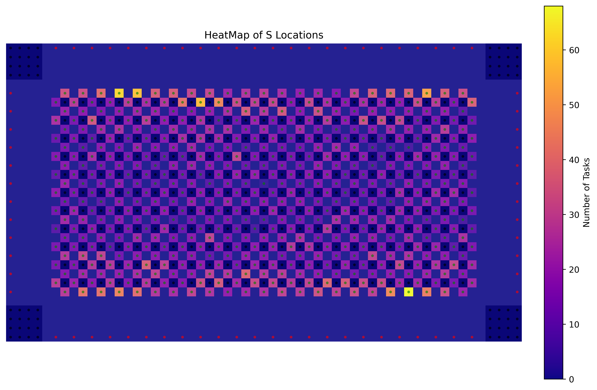

# Benchmark Problem Generators

This repo contains Python scripts to generate benchmark problem files used in the  [2024 LoRR competition](https://www.leagueofrobotrunners.org/).
This readme gives a simple introduction. For detailed usage instructions and examples, please refer to the [Tutorial](./markdown/Tutorial.md).

## Installation and Requirements

Requirements:
- Python 3.10 or higher
- easydict
- pyyaml
  
To get started with the scripts, you need to install the package. You can install it using pip:
```shell
pip install easydict
pip install pyyaml
```

## Benchmark Generator

The script `benchmark_generator.py` is used to create new problem instances. At a minimum, the program requires as input a map file, the sizes of agent teams, and the description of the task set. In the simplest usage, only the size of the task set is required and individual errands are randomly generated. We show this usage below:

```shell
python ./script/benchmark_generator.py  --mapFile  ./script/sortation_large.map --revealNum 1   --problemName randomTest --taskNum 5 --teamSizes 100 200 300 --benchmark_folder ./test --minEPT 1 --maxEPT 5
```

It is also possible to create problem instances using pre-generated task sets, which are specialised for certain types of maps (e.g. warehouse, see below). We show this usage below:
```shell
python ./script/benchmark_generator.py  --mapFile ./script/sortation_large.map --revealNum 1   --problemName warehouseTest --taskFile ./script/sortation_large.tasks --teamSizes 100 200 300 --benchmark_folder ./test --minEPT 1 --maxEPT 5
```

## Warehouse Map Generator

The script `warehouse_map_generator.py` is used to create warehouse maps. We distinguish two types of warehouses: sortation and fulfilment. In the example below,
we show how to generate a sortation map. The parameters of the map are given in a pre-specified configuration file (they can also be specified as command line arguments):

```shell
python ./script/warehouse_map_generator.py --config ./sortation_medium.yaml
```
or with command line arguments:

```shell
python ./script/warehouse_map_generator.py --mapWidth 200 --mapHeight 140 --output "sortation_medium.map" --stationConfig "sortation_emitter.txt" --storageSize 1 1 --stationDistance 1
```

## Warehouse Task Generator
The script `warehouse_task_generator.py` generates customized task sets for warehouse maps. Tasks are distributed according to different probabilistic models. 

### Distribution Types
- **Fullfilment**: Closer storage locations have higher selection probability, causing congestion at `E`.
- **Inverse Fullfilment**: Favors distant storage locations, leading to contraflows (`--inverse`).
- **Biased Emitters**: Prioritizes specific `E` locations (`--e_biases`).

### Probability Calculation
Probabilities are assigned based on distance-based bucketing:
1. **Bucketing**: Storage locations (`S`) are grouped into categories based on their Manhattan distance to the emitters (`E`). These categories define which locations are considered near or far. The following images are two examples of the buckets: [Left] 10 buckets, [Right] 20 buckets.

<div align="center">
  
  
</div>

2. **Probability Assignment**:
   - **Fullfilment**: Storage locations closer to emitters are assigned higher probabilities of selection, with exponentially decreasing chances for more distant locations.
   - **Inverse Fullfilment**: The probability is flipped so that farther storage locations are more likely to be chosen instead of nearby ones.

   First the bucket is chosen given the probability, then the storage location in the bucket is chosen uniformly. On the left, the heatmap of the 10000 tasks with 20 buckets generated with Fullfilment is shown, while on the right it shows the Inverse Fullfilment.

<div align="center">
  
  
</div>

3. **Selection Process**:
   - First, an emitter (`E`) is chosen either randomly or based on predefined biases (`e_biases`).
   - Then, a storage location (`S`) is selected from the appropriate bucket based on the assigned probabilities, ensuring the chosen location aligns with the distribution type.


### Command-Line Arguments

| Argument | Type | Default | Description |
|----------|------|---------|-------------|
| `--mapFile` | `str` | **(Required)** | Map file name |
| `--taskNum` | `int` | `10000` | Number of tasks to generate |
| `--m_buckets` | `int` | `-1` | Number of distance buckets for task distribution (random if `-1`) |
| `--task_type_rl` | `float list` | `[0.5, 0.5]` | Probability of choosing an `E` vs. `S` location |
| `--e_bucket_rl` | `float list` | `[0.25, 0.25, 0.25, 0.25]` | Probability distribution across `E` buckets |
| `--s_bucket_rl` | `float list` | `[1]` | Probability distribution across `S` buckets |
| `--minEPT` | `int` | `1` | Minimum number of errands per task |
| `--maxEPT` | `int` | `3` | Maximum number of errands per task |
| `--taskFile` | `str` | `"tasks.tasks"` | Output file name for tasks |
| `--e_biases` | `float list` | `None` | Bias values for choosing emitter locations |
| `--inverse` | `flag` | `False` | Use Inverse Fullfilment Distribution if set |
| `--mode` | `int` | `2024` | Select between 2023 and 2024 task generation policies |

## Usage Example
To run the script with a specified map and task distribution:

```sh
python warehouse_task_generator.py \
    --mapFile warehouse_large.map \
    --taskNum 5000 \
    --m_buckets 5 \
    --taskFile output.tasks \
    --mode 2024
```

This command:
- Loads `warehouse_large.map`
- Generates `5000` tasks
- Uses `5` distance buckets
- Saves tasks to `output.tasks`
- Uses the **2024** task generation mode

### Notes
- Default mode is **Fullfilment-like** (`--mode 2024`).
- Use `--mode 2023` for the generator used in **LORR 2023**.
- Use `--inverse` for **Inverse Fullfilment**.
- Customize emitter selection via `--e_biases`.
