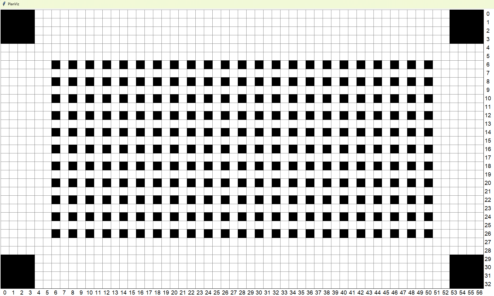
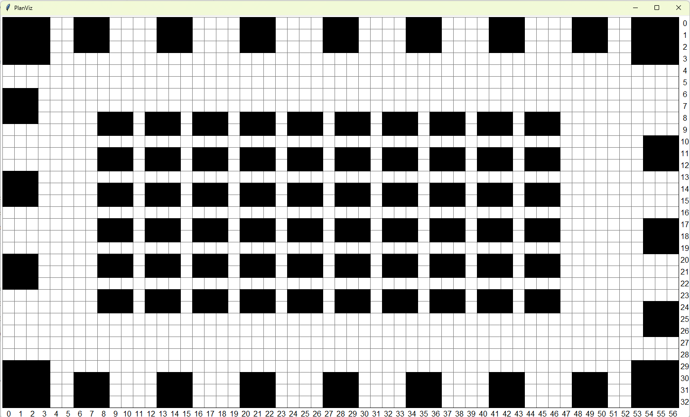

## Tutorial

 In the following tutorial, we will demonstrate how to generate a problem instance using the tools step by step.

### Folder Structure
```
├── benchmark_problems
|   ├── README.md
|   ├── script
|       ├── warehouse_generator.py
|       ├── warehouse_task_generator.py
|       ├── benchmark_generator.py
|       └── problem_generator.py
|    
├── Main Round Evaluation Instances
    ├── warehouse.domain
    |   ├── warehouse.json
    |   ├── maps
    |   ├── agents
    |   └── tasks
    ├── game.domain
    ├── random.domain
    └── city.domain
    
```
Each problem instance in this repository comprises four essential files: a map file delineating the environment, an agent file specifying initial configurations, a task file containing assigned tasks and a JSON file detailing the paths to the map, agent files, and task files. A benchmark is a collection of problem instances that all share the same map.

 An example JSON file is available in [sortation_large.json](../2023-main/warehouse.domain/I-06.json). It looks as follows.
 
```json
{
    "mapFile": "maps/sortation_large.map",
    "agentFile": "agents/Sortation_10000.agents",
    "teamSize": 10000,
    "taskFile": "tasks/sortation_large.tasks",
    "numTasksReveal": 1,
}
```
 
  This file should include the paths of the "mapFile", "agentFile", and "taskFile". Additionally, "teamSize" indicates the number of agents used in the instance, while other properties such as "numTasksReveal" and "taskAssignmentStrategy" pertain to task allocation strategies.

The map file stores 4-connected grid map information. A sample grid map is provided in [random-32-32-20.map](../script/random-32-32-20.map), while a typical warehouse grid map file can be found in [sortation_large.map](../script/sortation_large.map), where "." denotes empty space, and "@" and "T" represent obstacles. In warehouse maps, "E" typically denotes emitter points, which are locations where items are delivered, and "S" denotes service points where items are picked up. Both emitter points and service points are traversable, meaning they can be accessed and navigated through within the warehouse environment.

The agent file contains the initial positions of agents on the map. In the competition, we assume rotational agents that all begin with orientation `North` in their start locations. An example can be found in [example_100.agents](../script/example_100.agents). Positions are stored as vertex indexes (i.e., vertex_id=x* row+y) within this file.

The task file, such as [sortation_small.tasks](../script/sortation_small.tasks), stores sets of vertex indexes representing the task locations on the map.  For instance, in [sortation_small.tasks](../script/sortation_small.tasks), there are 100 tasks as specified by the second line. Each line following the number of tasks represents an individual task, which is a sequence of multiple errands that need to be visited. These errands are represented as vertex indexes separated by commas. A task is considered finished only if an agent has visited the errands in the specified sequence order. For more details, please refer to [CompetitionSetup.md](https://github.com/MAPF-Competition/web_resource/blob/develop/Competition%20Setup.md).


Within the script folders, tools for generating benchmark instances are available. A tutorial on their usage will be presented in the following section.


### 1. Benchmark Generator
A benchmark can include multiple instances with different numbers of agents. Instead of generating tasks individually for each agent count, we offer a benchmark generator that produces multiple instances in batches for a given map (either a MovingAI map or a new warehouse map).

#### Randomly Sample Task Sets
At a minimum, the program requires as input a map file, the sizes of agent teams, and the description of the task set. In the simplest usage, only the size of the task set is required and individual errands are generated by randomly sampled positions within the largest connected component of the map.

```shell
python ./script/benchmark_generator.py  --mapFile  ./script/random-32-32-20.map --revealNum 1  --problemName randomTest --taskNum 5000 --teamSizes 100 200 300 --benchmark_folder ./test 
```
This example generates benchmark instances with team sizes 100, 200, and 300, each with a randomly sampled agents file (specifying agent start locations) and all share one task set with 5000 locations (errands). The resulting benchmark is organised in the following structure:

```
├── test
    ├── randomTest_100.json
    ├── randomTest_200.json
    ├── randomTest_300.json
    ├── maps
    |   └── random-32-32-20.map 
    ├── agents
    |   ├── randomTest_100.agents
    |   ├── randomTest_200.agents
    |   ├── randomTest_300.agents
    └── tasks
        └── randomTest.tasks
    
```

#### Use Pre-generated Task Sets

It is also possible to create problem instances using pre-generated task sets, which are specialised for certain types of maps (e.g. warehouse, see below). We show this usage below:

```shell
python ./script/benchmark_generator.py  --mapFile ./script/sortation_large.map --revealNum 1  --problemName warehouseTest --taskFile ./script/sortation_large.tasks --teamSizes 100 200 300 --benchmark_folder ./test
```

This shell command generates three benchmark problem instances using the provided map and task file. These instances are generated for teams of sizes 100, 200, and 300. The resulting folder structure is as follows:

```
├── test
    ├── warehouseTest_100.json
    ├── warehouseTest_200.json
    ├── warehouseTest_300.json
    ├── maps
    |   └── warehouse_large.map
    ├── agents
    |   ├── warehouseTest_100.agents
    |   ├── warehouseTest_200.agents
    |   ├── warehouseTest_300.agents
    └── tasks
        └── warehouse_large.tasks
    
```


#### Arguments
- `--mapFile`: Path to an existing map file. The map file should be in the standard format, generated by map_generator.py or any grid map.

- `--taskNum`: The number of errands in the resulting random sampled task file. (use only if --taskFile is not given)

- `--taskFile`: Path to an existing task file generated by warehouse_task_generator.py. (use only if --taskNum is not given)

- `--problemName`: The name of the output problem file (default name: 'problem').

- `--teamSizes`: The number of agents in a team. Specify multiple values to generate multiple problems, each with a different team of agents. For example: --team_sizes 100 200 300.

- `--benchmark_folder`: Path to place the resulting problem files.

- `--revealNum`: Number of tasks revealed (should be greater than or equal to 1).

- `--taskAssignmentStrategy`: Task assignment strategy (roundrobin, greedy), for warehouse maps.

- `--taskNum`: The number of tasks on grid maps 

- `--minEPT`: The minimum number of errands per task (default:1)

- `--maxEPT`: The maximum number of errands per task (default:3)


### 2. Warehouse Map Generator
For warehouse benchmarks used in this competition, we provide tools to generate maps and tasks that closely mimic real-world warehouse distributions.

To generate a map,  we provide a tool for generating new warehouse maps.  Alternatively, you can download a grid map from [MAPF_Benchmark](https://movingai.com/benchmarks/mapf.html). 

The Python script "warehouse_generator.py" generates a warehouse layout, as seen in [sortation_large.map](../script/sortation_large.map), featuring pickup stations and storage shelves. This script accepts
a YAML configuration file, which specifies map parameters such as warehouse dimensions, the number of pickup stations, and optionally a configuration file to customize the warehouse layout. 
Please refer to [WarehouseMapGenerator.md](./WarehouseMapGenerator.md) for detailed documentation on YAML configuration.


#### Example Usage

Generate a warehouse sortation centre map using [sortation_medium.yaml](../script/sortation_medium.yaml) :

```shell
python ./script/warehouse_map_generator.py --config ./sortation_medium.yaml
```

or using command line arguments:

```shell
python ./script/warehouse_map_generator.py --mapWidth 200 --mapHeight 140 --output "sortation_medium.map" --stationConfig "sortation_emitter.txt" --storageSize 1 1 --stationDistance 1
```
Example warehouse sortation centre map:


##### Generate a warehouse fulfilment centre map using [fulfillment_config.yaml](../script/fulfillment_config.yaml):
```shell
python ./script/warehouse_map_generator.py --config ./fulfillment_config.yaml
```

or using command line arguments:

```shell
python ./script/warehouse_map_generator.py --mapWidth 57 --mapHeight 33 --output "warehouse_small.map" --stationConfig "picking_station.txt" --storageSize 3 2
```
Example warehouse fulfilment centre map:



#### Arguments

- `--config CONFIG`: Path to a YAML configuration file that contains the warehouse map generator parameters.

- `--mapWidth MAP_WIDTH`: (Required if --config is not provided) Width of the warehouse.
- `--mapHeight MAP_HEIGHT`: (Required if --config is not provided) Height of the warehouse.
- `--output MAP_NAME`: (Required if --config is not provided) Name of the generated warehouse map.
- `--stationConfig`: (Required if --config is not provided) The file name of the pickup station layout, see the following description.
- `--stationNumber STATION_NUM`: (Required if --config is not provided) Number of pickup stations to be added in the warehouse.
- `--stationDistance (default 2)`: distance between two consecutive emitters
- `--corridorWidth (default 1)`:  distance between two storage blocks
- `--pillarWidth (default 4)`: width of the pillar
- `--operWidth (default 5)`: distance between the pickup station and the sotrage area
- `--storageSize (default [3,2])`: (width, height) of the storage


### 3. Warehouse Task Generator

After generating a warehouse map, we then can generate the task files based on the map.
The Task Generator script "warehouse_task_generator.py" is used to generate task files for a given map and agent configuration. It provides two types of task generation policy: random task generation and task generation with distribution based on the average distance (see [WarehouseTaskGenerator.md](./WarehouseTaskGenerator.md) for more details).

#### Example Usage
```shell
 python ./script/warehouse_task_generator.py --mapFile ./script/warehouse_large.map  --taskNum 100 --taskFile ./tasks.tasks --m_buckets 5 --minEPT 1 --maxEPT 3
```
The shell command generates a task file named "tasks.tasks" containing 100 tasks. It utilizes the "warehouse_large.map" and employs the distance-based generation policy with 5 buckets. The resulting task file can be then used for generating benchmarks.

#### Arguments
- `--mapFile`: Path to the map file. The map file should be in the standard format.
- `--taskNum`: Number of tasks to generate. Must be greater than or equal to 1.
- `--taskFile`: Name of the output task file. The generated tasks will be saved to this file.
- `--m_buckets`: Number of buckets for task generation with distribution based on average distance. If `-1` is provided, random policy for task generation will be used.
- `--task_type_rl`: Relative likelihood of selecting an "E" (Endpoint) or an "S" (Startpoint) location. Default value is `[0.5, 0.5]`.
- `--e_bucket_rl`: Relative likelihood of each "E" bucket. Default value is `[0.25, 0.25, 0.25, 0.25]`.
- `--s_bucket_rl`: Relative likelihood of each "S" bucket. Default value is `[1]`.
- `--minEPT`: The minimum number of errands per task (default:1)
- `--maxEPT`: The maximum number of errands per task (default:3)


